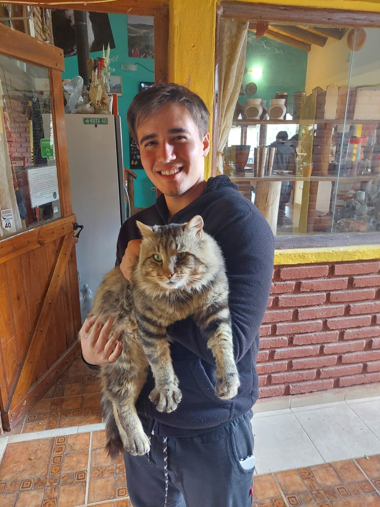

# ¡Buenos días estrellitas, la Tierra les dice hola!

Esta mi presentación para la materia, espero les guste.

  

## Sobre mí:

Me llamo Nicolás Ezequiel Rio, tengo 23 años y mi legajo es 214.062-7. 
Soy Técnico en Informática egresado del Colegio Parroquial Juan XXIII 
y estoy en el 2do año de la carrera. 

Aunque la foto parezca indicar lo contrario, prefiero los perros. 
Tengo uno llamado Teo y, aunque está viejito, tiene mucha vitalidad. 
Acá se los muestro:

  

## Curiosidad:

El gato de la foto es una cruza entre uno doméstico y un "Gato Andino", que es una especie protegida 
muy rara de ver hoy en día.

